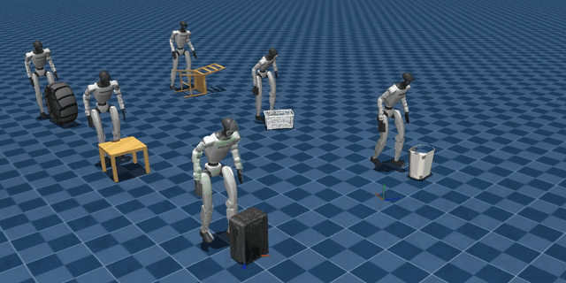

#  orcs

*Optimize, Retarget, Control Suite*

a pkg for training privileged humanoid controllers. supports:

* LoRA PEFT  (currently supports [SONIC](https://nvlabs.github.io/GEAR-SONIC/))
* kinodynamic retargeting of `smpl` motions.
* *tabula rasa* training (untested)

## tasks

<table>
  <tr>
    <td align="center">
      <a href="src/orcs/tasks/perloco"></a><br>
      <code>Orcs-PerLoco-OmRe-AdaptSonic</code>
    </td>
    <td align="center">
      <a href="src/orcs/tasks/uolm"></a><br>
      <code>Orcs-Uolm-AdaptSonic</code>
    </td>
  </tr>
  <tr>
    <td align="center">
      <a href="src/orcs/tasks/perloco"></a><br>
      <code>Orcs-PerLoco-Grail-AdaptSonic</code>
    </td>
    <td align="center">
      <a href="src/orcs/tasks/dodge"></a><br>
      <code>Orcs-Dodge-AdaptSonic</code>
    </td>
  </tr>
  <tr>
    <td align="center">
      <a href="src/orcs/tasks/perloco"></a><br>
      <code>Orcs-PerLoco-Grail-AdaptSonic-Smpl</code>
    </td>
    <td align="center">
      <a href="src/orcs/tasks/uolm"></a><br>
      <code>Orcs-Uolm-SmallCubeTable-AdaptSonic-Smpl</code>
    </td>
  </tr>
</table>

## setup

Requires Python 3.11, Git LFS, and GitHub SSH access, plus
[uv](https://docs.astral.sh/uv/getting-started/installation/). A conda env works
too — `sync_dependencies.sh` detects the active env and picks `pip` or `uv pip`
(override with `DEPS_PIP_CMD`). From the repository root:

```bash
uv venv --python 3.11 .venv
source .venv/bin/activate

# Standard install — Dodge + UOLM, releases included.
uv pip install -e .

# Staging tooling, not tasks — for perceptive_locomotion.sh + orcs-pseudo-retarget.
# uv pip install -e ".[perloco]"

# Full contributor setup (tests, lint, and PerLoco/SMPL tooling).
# uv pip install -e ".[dev,perloco]"

# Fetch pinned dependencies/data, generate object assets and the nominal clip.
bash scripts/setup/sync_dependencies.sh

# Optional — fetch and stage OmniRetarget + GRAIL for PerLoco.
bash scripts/setup/perceptive_locomotion.sh

# Optional — generate SMPL seed states for dynamic retargeting.
# `--all` means every sample of the scene's DEFAULT_MOTION_SETS, not every motion
# set; the two extra UOLM sets are staged by name.
orcs-pseudo-retarget --scene perloco-grail --all
orcs-pseudo-retarget --scene uolm --all
orcs-pseudo-retarget --scene uolm --motion-set small-cube-table --all
orcs-pseudo-retarget --scene uolm --motion-set big-cube-floor --all

# Optional: download and verify all public release checkpoints.
bash scripts/setup/download_released_models.sh
```

Public checkpoints: [huggingface.co/lkrajan/orcs](https://huggingface.co/lkrajan/orcs).

> [!IMPORTANT]
> `sync_dependencies.sh` must be the **last** install in the env. It pins
> `mocke`/`rsl_rl`/`assets` to editable forks; a later `pip install` — adding an
> extra after the fact, say — resolves them off PyPI and uninstalls the forks,
> which drops `SonicWithAdapterModel` and breaks every AdaptSonic task. Add an
> extra, then re-run the script. `import orcs` warns when this has happened.

> [!NOTE]
> The PerLoco setup prompts for the separately licensed SMPL-X model when needed.
> Stage all three neutral/male/female `.npz` files — reconstructed UOLM staging
> falls back to `SMPLX_MALE.npz` when SMPL-H is absent.
> See [perceptive locomotion](docs/perceptive_locomotion.md) and
> [SMPL retargeting](docs/smpl_retargeting.md) for options and dataset details.
> Missing optional data skips only the affected tasks; inspect `orcs.SKIP_REASON`.

Verify task registration:

```bash
python -c "import mjlab, orcs; from mjlab.tasks.registry import list_tasks; print('\n'.join(list_tasks()))"
```

## play

```bash
# release — download once, then load the verified public checkpoint
play Orcs-Dodge-AdaptSonic --agent release --viewer native
play Orcs-Uolm-AdaptSonic --agent release --viewer native
# PerLoco needs perceptive_locomotion.sh — else unregistered, see orcs.SKIP_REASON.
play Orcs-PerLoco-Grail-AdaptSonic --agent release --viewer native

# initial — construct the initial policy (base w/ zero-initialized adapters)
play Orcs-Uolm-AdaptSonic --agent initial --viewer native

# trained — load trained checkpoint
# wandb
play Orcs-PerLoco-OmRe-AdaptSonic --wandb-run-path= <wandb-run-path> \
--viewer native
# local
play Orcs-PerLoco-OmRe-AdaptSonic --agent trained \
  --checkpoint-file /path/to/checkpoint.pt --viewer native

# zero — hold zero actions while inspecting the task
play Orcs-PerLoco-Grail-AdaptSonic-Smpl --agent zero --viewer native

# random — sample actions while inspecting the task
play Orcs-Uolm-SmallCubeTable-AdaptSonic-Smpl --agent random --viewer native
```

## train

```bash
train Orcs-Uolm-AdaptSonic --env.scene.num-envs 4096
train Orcs-PerLoco-Grail-AdaptSonic --env.scene.num-envs 4096
```

## paths

| variable | default |
|---|---|
| `ORCS_DATA_ROOT` | `<repo>/data` |
| `ORCS_DEPS_ROOT` | `<repo>/dependencies` |
| `ORCS_ASSETS_SOURCE` | host assets checkout, then installed `assets` package |
| `ORCS_SMPLX_DIR` | `<deps>/GRAIL/imports/GEM-SMPL/inputs/checkpoints/body_models` |
| `ORCS_RELEASE_ROOT` | `~/.cache/orcs/releases` or `$XDG_CACHE_HOME/orcs/releases` |

## license and credits

ORCS code and documentation are [BSD-3-Clause](LICENSE). Third-party code,
models, datasets, and body-model files retain their upstream terms; see
[THIRD_PARTY_NOTICES.md](THIRD_PARTY_NOTICES.md).

ORCS builds on SONIC, GRAIL, OmniRetarget, DexMachina, ResMimic, MimicKit,
mjlab, and RSL-RL. Please cite the relevant projects and datasets.

## citation

`orcs` was developed as part of [ViBe](https://arxiv.org/abs/2609.09918). If you
use this repository in your research, please consider citing:

```bibtex
@misc{krishna2026vibe,
  title={ViBe: Visual Behavior Adaptation for Perceptive Humanoid Whole-Body Control},
  author={Lokesh Krishna and Sarvesh Venkatesan and An Zhang and Quan Nguyen},
  year={2026},
  eprint={2609.09918},
  archivePrefix={arXiv},
  primaryClass={cs.RO},
  url={https://arxiv.org/abs/2609.09918},
}
```
