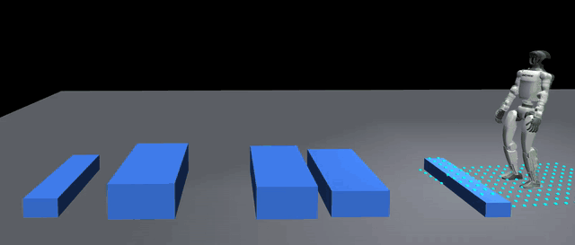
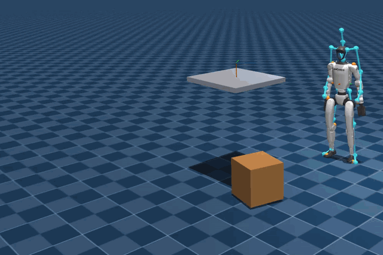
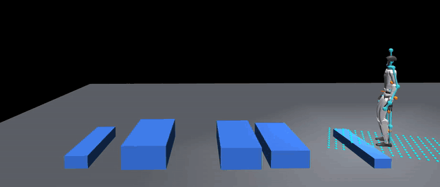
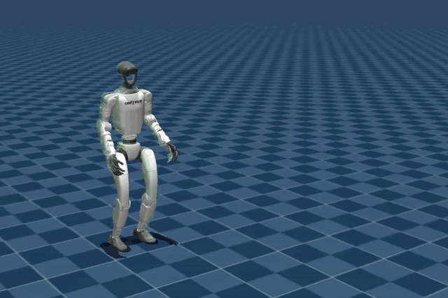
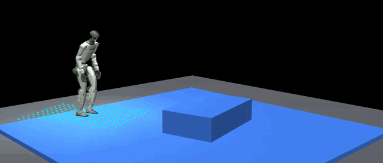

#  orcs

A package for synthesizing privileged control policies for:

1. LoRA PEFT and *tabula rasa* training 
2. teacher policies for distillation 
3. kinodynamic retargeting of human motions.

## supported tasks
<table>
  <tr>
    <td align="center" width="50%">
      <a href="src/orcs/tasks/perloco"></a><br>
      <code>Orcs-PerLoco-Grail-AdaptSonic</code>
    </td>
    <td align="center" width="50%">
      <a href="src/orcs/tasks/uolm"></a><br>
      <code>Orcs-Uolm-SmallCubeTable-AdaptSonic-Smpl</code>
    </td>
  </tr>
  <tr>
    <td align="center">
      <a href="src/orcs/tasks/perloco"></a><br>
      <code>Orcs-PerLoco-Grail-AdaptSonic-Smpl</code>
    </td>
    <td align="center">
      <a href="src/orcs/tasks/dodge"></a><br>
      <code>Orcs-Dodge-AdaptSonic</code>
    </td>
  </tr>
  <tr>
    <td align="center">
      <a href="src/orcs/tasks/perloco"></a><br>
      <code>Orcs-PerLoco-OmRe-AdaptSonic</code>
    </td>
    <td align="center">
      <code>Orcs-Uolm-AdaptSonic</code><br>
      <code>Orcs-Uolm-AdaptSonic-Smpl</code>
    </td>
  </tr>
</table>

## install

Requires Python 3.11, Git LFS, and GitHub SSH access for the pinned research
dependencies. Run from the repository root:

```bash
uv venv --python 3.11 .venv
source .venv/bin/activate

# Include perloco before syncing: staging needs USD and SMPL-X.
uv pip install -e ".[dev,perloco]"

# Sync pinned data/dependencies and generate UOLM object models.
bash scripts/setup/sync_dependencies.sh
```

Verify the installation:

```bash
python -c "import mjlab, orcs; from mjlab.tasks.registry import list_tasks; print('\n'.join(list_tasks()))"
```

Missing optional datasets suppress only their corresponding task rows. Inspect
`orcs.SKIP_REASON` for the exact reason without enabling import-time warnings.

> [!NOTE]
> Importing `mjlab` discovers and registers ORCS tasks. Bare `import orcs` is
> intentionally lightweight; accessing `orcs.SKIP_REASON` also triggers discovery.
> Import `mjlab` first before importing ORCS task, asset, or MJLab-backed core
> submodules directly.

## setup

- [Perceptive locomotion](docs/perceptive_locomotion.md): fetch and stage the
  OmniRetarget or GRAIL terrain-motion datasets.
- [SMPL retargeting](docs/smpl_retargeting.md): kinematically retarget a target datset and then launch the matching `*-Smpl` task
  for dynamics refinement.

> [!NOTE]
> The licensed SMPL-X body model is the only manual download in the GRAIL setup.
> Both workflows are resumable and follow the packaged terrain rosters.

## play and train

```bash
# `--agent initial` runs an initial policy i.e. first training iteration
play Orcs-Uolm-AdaptSonic --agent initial --viewer native
play Orcs-PerLoco-Grail-AdaptSonic --agent initial --viewer native

train Orcs-Uolm-AdaptSonic --env.scene.num-envs 4096
train Orcs-PerLoco-Grail-AdaptSonic --env.scene.num-envs 4096
```

## paths

ORCS resolves data and dependencies from the host repository when vendored.
Override them only when the default layout is unsuitable:

| variable | default |
|---|---|
| `ORCS_DATA_ROOT` | `<repo>/data` |
| `ORCS_DEPS_ROOT` | `<repo>/dependencies` |
| `ORCS_ASSETS_SOURCE` | host assets checkout, then installed `assets` package |
| `ORCS_SMPLX_DIR` | `<deps>/GRAIL/imports/GEM-SMPL/inputs/checkpoints/body_models` |

## development

```bash
ruff check src scripts tests
pytest
```

See [docs/ethos.md](docs/ethos.md) for package boundaries and the task contract.

## research provenance

The virtual-force curricula was explored by
[DexMachina](https://arxiv.org/abs/2505.24853) and
[ResMimic](https://arxiv.org/abs/2510.05070)

The dodgeball task adapts the published reward from
[MimicKit/SMP](https://github.com/xbpeng/MimicKit). See
[`THIRD_PARTY_NOTICES.md`](THIRD_PARTY_NOTICES.md) for its Apache-2.0 terms.

## acknowledgements

ORCS relies on ideas, data, models, or infrastructure from
[SONIC](https://github.com/NVlabs/GR00T-WholeBodyControl),
[GRAIL](https://github.com/NVlabs/GRAIL),
[OmniRetarget](https://huggingface.co/datasets/omniretarget/OmniRetarget_Dataset),
[DexMachina](https://github.com/MandiZhao/dexmachina),
[ResMimic](https://resmimic.github.io/),
[MimicKit](https://github.com/xbpeng/MimicKit),
[mjlab](https://github.com/mujocolab/mjlab), and
[RSL-RL](https://github.com/leggedrobotics/rsl_rl). Please cite the relevant
papers and datasets when using those parts of the system.

## license

ORCS's original code and documentation are available under the [BSD 3-Clause License](LICENSE). Third-party code, models, datasets, and body-model files retain their upstream
terms; see [THIRD_PARTY_NOTICES.md](THIRD_PARTY_NOTICES.md).
